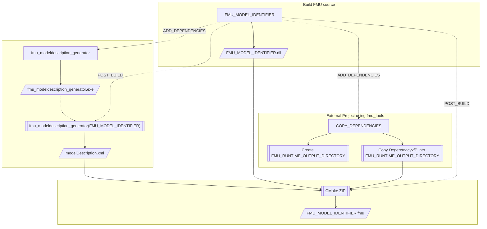
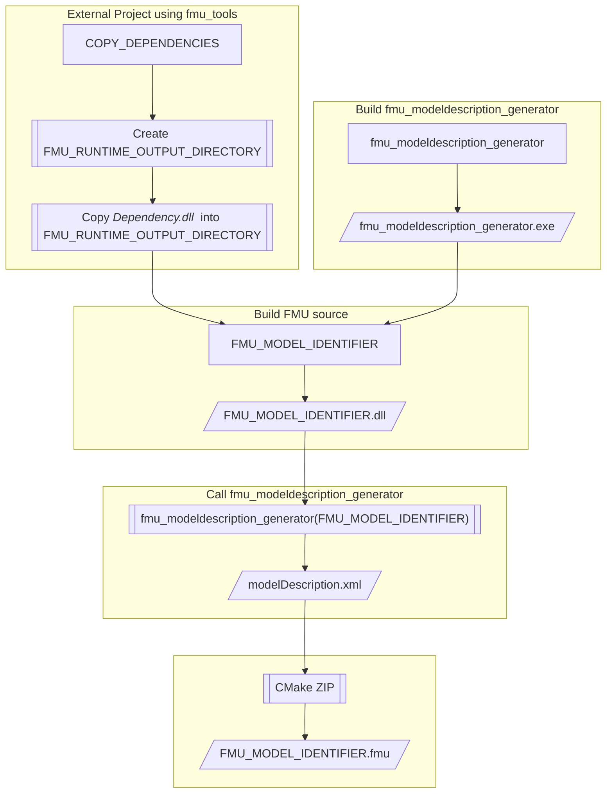

# Fmu Tools
The `fmu_tools` library offers a set of utilities to import/export any existing model from/into an FMU.

For the FMU export, the library, mainly through its main class `FmuComponentBase`, provides a higher C++ layer that:
- on the outer side: offers to the final user the standard FMU interface 
- on the inner side: offers to the FMU developer an extensive set of utilities to bind its model to the FMU instance

The CMake infrastructure takes care of:
- building the source code;
- generating the _modelDescription.xml_;
- creating the standard FMU directory layout;
- packaging into a _.fmu_ ZIP archive;
- running compliance checks on the generated FMU.

For the FMU import, the library can dynamically link to any FMU and offers some auxiliary function to easily access internal variables by name, recognizes Modelica visualization shape structures by parsing the _modelDescription.xml_.

WARNING: please mind that we are currently dealing only with **CoSimulation** FMUs.


### Using the Library

## Fmu Export

A simple use of the library consists in just taking the project and modifying _myFmuComponent.h_ and _myFmuComponent.cpp_ based on the user needs. This is the recommended way for simpler projects.

Those who like to use `fmu_tools` directly from their own projects are invited to look at the [Chrono](https://github.com/projectchrono/chrono) library to have an idea on a more advanced integration. Especially the [chrono/template_project_fmu](https://github.com/projectchrono/chrono/tree/main/template_project_fmu) folder.

In either case, this library offers a set of tools that need to be further specialized for the user-specific problem. This is done by inheriting from `FmuComponentBase`, plus some additional customization. One example is provided by the `myFmuComponent` class. The impatient user could also just copy and modify this class straight away.

For those that want to develop their own indipendent class, they are required to:

1. in CMake, set the `FMU_MODEL_IDENTIFIER` to any valid name (consider your operating system and C-function naming standards); a new target with same name will be created;
2. derive from `FmuComponentBase` your own class; please refer to `myFmuComponent` for an example;
3. the derived class should:
   - in the constructor, remember to call `FmuComponentBase::instantiateType(_fmuType)`;
   - in the constructor, add all the relevant variables of the model to the FMU through `AddFmuVariable`; variable measurement units are supported and some default units are already declared; please also remember that the variables that are here binded to the FMU must be updated during `_doStep` call; an auxiliary function (namely `updateVars`) is automatically called after the call to `_doStep` to run all the functions listed into the `updateVarsCallbacks` variable; it's up to the user to register the updating functions to this list;
   - a predefined `time` variable comes pre-binded to the FMU: remember to update it as well;
   - override `FmuComponentBase::is_cosimulation_available()` and `FmuComponentBase::is_modelexchange_available()` so that they would return the proper answer;
   - override `_doStep` method of the base class with the problem-specific implementation;
   - optionally override `FmuComponentBase::_enterInitializationMode()` and `FmuComponentBase::_exitInitializationMode()`: between these two calls the user should be able to set the parameters of the simulation; after the call to `_exitInitializationMode` the model should be ready to run;
   - optionally override `FmuComponentBase::_preModelDescriptionExport()` and `FmuComponentBase::_postModelDescriptionExport()`: to generate the _modelDescription.xml_ file the class gets constructed, but *not* initialized; if some setup (e.g. calling `_exitInitializationMode`) is required to populate the model with all the proper variables this could be done in these methods.
4. provide the implementation of `fmi2Instantiate_getPointer` similarly to:
   ```
   FmuComponentBase* fmi2Instantiate_getPointer(
     fmi2String instanceName,
     fmi2Type fmuType,
     fmi2String fmuGUID)
   {
     return new myFmuComponent(instanceName, fmuType, fmuGUID);
   }
    ```

Adding variables to the FMU is possible in two different flavours: by just passing the address of any given variable whose type is directly supported by the FMU interface or by providing a pair of getter/setter methods. Since the definition of these function pairs might not be immediate an helper macro `MAKE_GETSET_PAIR` is offered.

When everything is set up, build the **PACK_FMU** target to generate the FMU file.

### Advanced Options for Export

- in the rare case that the user requires a different set of FMI variable types, it is required to modify _fmi2_headers\fmi2TypesPlatform.h_ accordingly; in this case the _TypesVariants.h_ file should be modified as well, so that the two variants declared do not contain any repeated type;
- while adding new FMU variables, the user can associate a measurement unit to them (otherwise the adimensional unit "1" will be set). However, units needs to be defined _before_ any FMU variable could use them. Measurement units are defined through the `UnitDefinitionType` class, that stores the name of the unit (e.g. "rad/s2") together with the exponents of each SI base unit (e.g. rad=1, s=-2). The user should create its own object of type `UnitDefinitionType` and then pass it to `FmuComponentBase` through its method `addUnitDefinition`. After this step, the user can use the unit name in any following call to `AddFmuVariable`;
- the `RUN_TESTS` target will run the _fmuChecker_ utility over the newly created fmu and makes sure no error is returned (only 'win64' and 'linux64' are available for now);
- the _modelDescription.xml_ file is created by calling a specific function exported by the very same FMU (namely `createModelDescription()`). This function actually instantiates an object of the class inherited from `FmuComponentBase` and then calls its `FmuComponentBase::ExportModelDescription` method. As you may see, no initialization is made on the class/fmu. However, this might be a problem for some models that have no valid default parameters. In order to overcome this limitation, the `FmuComponentBase::ExportModelDescription` method calls the pair of `FmuComponentBase::_preModelDescriptionExport()` and `FmuComponentBase::_postModelDescriptionExport()`.


## Fmu Import

The target `fmu_host` shows how to load and run FMUs. By default, it is set up to use the FMU generated by the FMU export target.

The FMU gets automatically unzipped.


## Features and TODOs

- [x] basic import of CoSimulation FMUs
- [x] basic export of CoSimulation FMUs
- [ ] basic import of ModelExchange FMUs
- [ ] basic export of ModelExchange FMUs

### Common Features
- [x] associate Units to Variables
- [x] keep C++14 compliance (_filesystem_ and _variant_ custom C++14 compliant implementation are offered)
- [x] check compatibility of causality|variability|initial attributes for variables
- [x] accept getter function instead of the usual pointer to variable (guarantee that this is allowed only for variables that can never be set)
- [x] allow non-default types through 'fmi2TypesPlatform.h'

### Export Features
- [x] register local variables as FMU variables
- [x] automatic creation of *modelDescription.xml* based on registered variables
- [x] automatic build, *modelDescription.xml* generation and zipping (through CMake post-build)
- [x] GUID creation
- [x] set of Resources folder


### Import Features
- [x] unzip the FMUs (cross-platform, header-only)
- [x] GUID checks (optional)
- [x] additional function to easily retrieve variables through names instead of refvals 

### Extras and Testing
- [x] test exported FMUs through the importer
- [x] test exported FMUs with fmuChecker
- [x] automatic testing with fmuChecker
- [x] test on Win
- [x] test on Linux (GCC8.5.0)
- [ ] test on MacOS
- [x] importing `fmu_tools` into other project


## Developer Guide

The creation of an FMU requires few steps that are automatically carried on by CMake. In order to reuse the code in your own toolchain we are currently suggesting to use CMake _FetchContent_ feature. In this way the targets gets correctly imported in your project togetheir with their properties.

In order to better grasp what is happening under the hood it is important to understand both the target/command dependencies and the order in which they are triggered.

The dependencies can be depicted as:



The layout above ends up triggering the various commands/build in the following order:



Please consider the legend:


